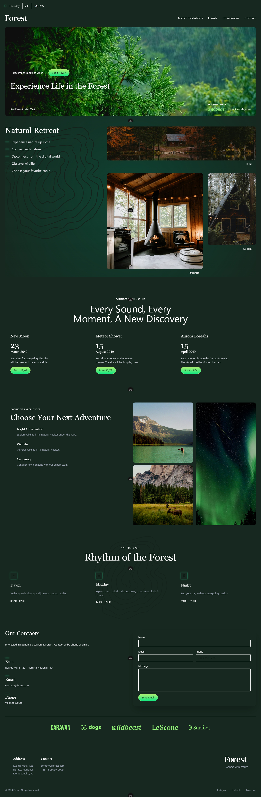
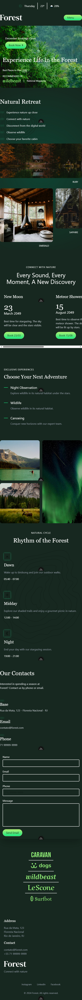

# 🌳 ForestLife

ForestLife is a **modern, elegant and responsive website** for eco-lodges and forest retreats. Built with **Vue 3**, **Nuxt.js**, and **Tailwind CSS**, it offers a beautiful UI for showcasing accommodations, events, and exclusive adventures in the forest.

This project is fully optimized for an immersive user experience.


## 📸 Screenshots

| Desktop View                                            | Mobile View                                           |
| ------------------------------------------------------- | ----------------------------------------------------- |
|  |  |


## 🛠 Built With

* [Nuxt.js](https://nuxt.com/) – The Intuitive Vue Framework
* [Vue 3](https://vuejs.org/) – Progressive JavaScript Framework
* [Tailwind CSS](https://tailwindcss.com/) – Utility-first CSS framework
* [TypeScript](https://www.typescriptlang.org/) – Static type checking
* [Vite](https://vitejs.dev/) – Lightning fast hot module replacement (HMR)
* [Heroicons](https://heroicons.com/) – Beautiful hand-crafted SVG icons


## 📦 Getting Started

### 1️⃣ Clone the repository

```bash
git clone https://github.com/testfordb/next-js-forest-website
cd next-js-forest-website
```

### 2️⃣ Install dependencies

```bash
npm install
# or
yarn install
# or
pnpm install
```

### 3️⃣ Run development server

```bash
npm run dev
# or
yarn dev
# or
pnpm dev
```

Open [http://localhost:3000](http://localhost:3000) in your browser to see the app.


## 🚀 Deployment

You can deploy this Nuxt.js app on **Vercel**, **Netlify**, or any Node-compatible server:

[](https://vercel.com/new/project?utm_source=github&utm_medium=readme&utm_campaign=forestlife)


## 📚 Learn More

* [Nuxt.js Docs](https://nuxt.com/docs)
* [Vue 3 Docs](https://vuejs.org/guide/introduction.html)
* [Tailwind CSS Docs](https://tailwindcss.com/docs)
* [TypeScript Docs](https://www.typescriptlang.org/docs/)


## 👨‍💻 Author

* **testfordb:** – [GitHub](https://github.com/testfordb)


## 📜 License

This project is licensed under the MIT License.
